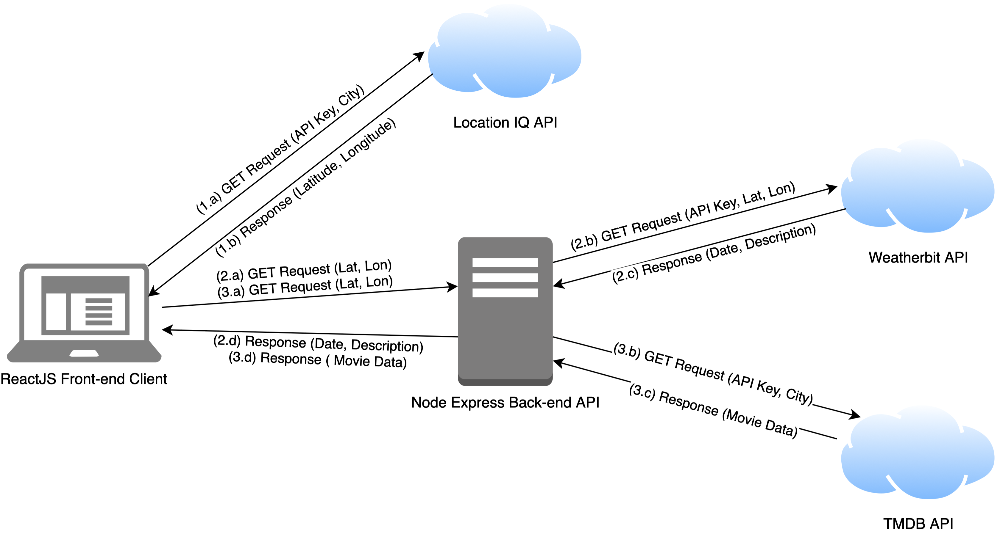

# Project Name

**Author**: Ben Choe
**Version**: 0.2.0

## Overview
When given a city, provides the user with a basic map, weather forecasts, and movies related to the city.

## Getting Started
For this front-end client, Node.js, React, React-Bootstrap, Bootstrap, and axios must be installed.

## Architecture
This is a very basic API web client.

## Change Log
This code went through many changes, though the history has been lost from a repo recreate.

## Credit and Collaborations
- Vinny Shipley
- Guy Farley
- Cody Davis

## WRRC

